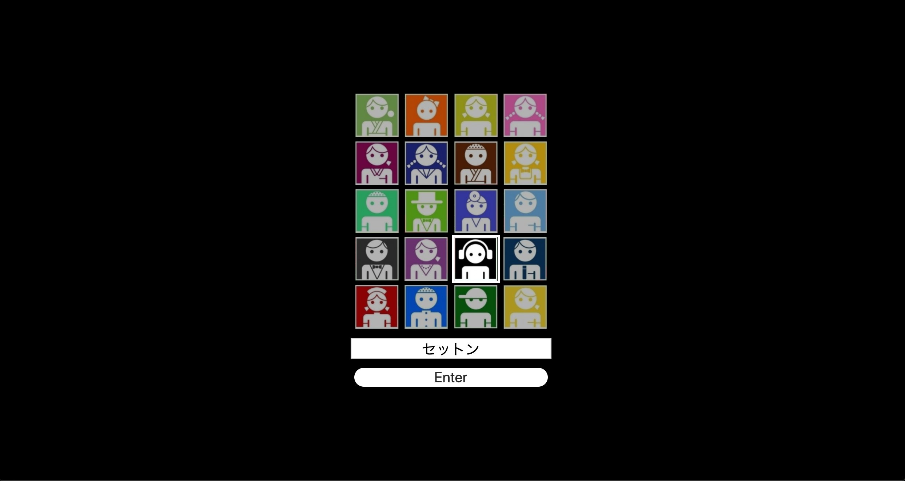
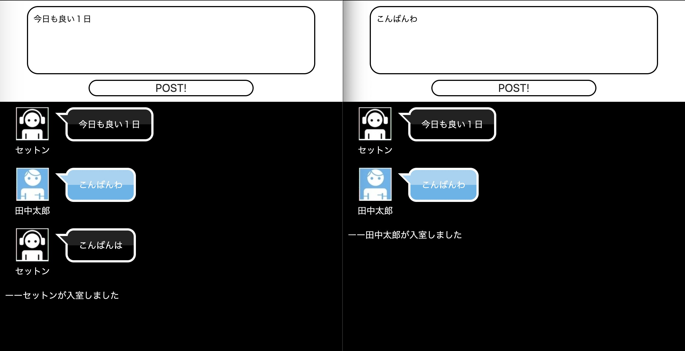
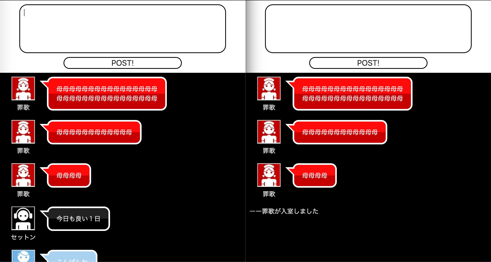

# durachat

アニメ デュラララで利用されているチャットシステムを再現してみました。

## 技術スタック

- React
- styled-components
- express
- socket.io

## 実行手順

各種パッケージインストール  
`yarn install`

webpack-dev-server起動(3000番ポート)  
`yarn dev`

socket.io用サーバを起動(8080番ポート)  
`node server.js`

## TODO

- [ ] コンポーネントのリファクタリング
- [ ] Contextの導入検討
